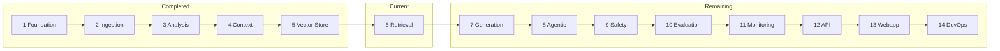

# Phases of the Project — SentiMedical-RAG (V.E.D.A.M.A.X.)

This document defines the full build roadmap for SentiMedical-RAG: completed work, current phase, remaining phases, and the steps required for each. It includes the original pipeline phases plus production enhancements (vLLM, quantization, observability, and clinical guardrails).

---

## Progress Summary

| Metric | Value |
|--------|------:|
| Total phases | **14** |
| Completed | **6** |
| Current phase | **7 — Generation** |
| Remaining | **8** (Phases 7–14) |
| Overall progress | **~43%** |

---

## Recommended Build Order (Critical Path)

Not every phase must finish 100% before the next starts, but this order minimizes rework:

1. Fix known blockers (e.g. `input_analyzer` missing `import time`)
2. **Phase 6** — Retrieval orchestration
3. **Phase 7** — Generation (abstract LLM client first)
4. **Phase 12 (partial)** — `POST /query` API route
5. **Phase 13** — Wire Streamlit webapp to real backend
6. **Phase 9** — Input/output guardrails (before clinical beta)
7. **Phase 11** — LangSmith runtime tracing
8. **Phase 10** — Ragas evaluation pipeline
9. **Phase 8** — LangGraph agentic routing
10. **Phase 14** — vLLM, quantization, CI/CD, infra

---

## Phase 1 — Foundation

**Status:** ✅ Complete

**Goal:** Shared configuration, logging, and utilities for all modules.

**Deliverables:**
- `src/config/settings.py` — Pydantic settings from `.env`
- `src/config/logging_config.py` — Structured logging
- `src/config/constants.py` — Application constants
- `src/utils/` — File, text, and validation helpers
- `env.example`, `pyproject.toml`, `requirements.txt`

**Steps taken / verified:**
- [x] Centralized settings (Qdrant, embeddings, LLM, safety, DB, JWT)
- [x] Logging setup with configurable log level
- [x] Project package structure initialized
- [x] Environment variable template documented

---

## Phase 2 — Ingestion

**Status:** ✅ Complete

**Goal:** Parse medical documents, chunk text, and prepare data for embedding.

**Deliverables:**
- `src/ingestion/parsers/` — PDF, DOCX, base parser, parser factory
- `src/ingestion/chunkers/` — Semantic and token chunking
- `src/ingestion/processors/` — OCR, table extraction
- `src/ingestion/etl_pipeline.py` — ETL orchestration
- `src/ingestion/batch_processor.py`, `chunk_metadata.py`

**Steps taken / verified:**
- [x] PDF parsing (Docling / PyPDF2)
- [x] DOCX parsing
- [x] Semantic and token chunking strategies
- [x] Medical table extraction
- [x] OCR processor for image-based documents
- [x] Batch processing support

**Follow-up steps (not yet done):**
- [ ] Wire `scripts/ingest_documents.py` to real `ETLPipeline` (currently placeholder)
- [ ] End-to-end ingest → Qdrant script tested on sample PDFs

---

## Phase 3 — Analysis (NER + Sentiment)

**Status:** ✅ Complete (with one known bug)

**Goal:** Analyze user input in parallel: medical entities, emotion classification, persona mapping.

**Deliverables:**
- `src/analysis/ner/` — Medical NER, entity types
- `src/analysis/sentiment/` — Emotion classifier, aggregator, persona mapper
- `src/analysis/input_analyzer.py` — Orchestrates NER + sentiment

**Steps taken / verified:**
- [x] Medical NER (Med7 / spaCy)
- [x] Emotion classification (RoBERTa go_emotions)
- [x] Emotion → persona mapping (empathy level, safety priority)
- [x] Parallel analysis via ThreadPoolExecutor
- [x] Async and batch analysis APIs

**Steps to take care of:**
- [ ] Fix `input_analyzer.py`: add `import time` (runtime `NameError` today)
- [ ] Add unit tests for `InputAnalyzer`, NER, and sentiment modules
- [ ] Validate Med7/spaCy model install in setup docs

---

## Phase 4 — Context & Memory

**Status:** ✅ Complete

**Goal:** Per-user profiles, session memory, emotion tracking, and risk escalation for personalized, safe responses.

**Deliverables:**
- `src/context/storage.py` — PostgreSQL storage layer
- `src/context/user_profile.py` — User profiles and preferences
- `src/context/memory_manager.py` — Session and long-term memory
- `src/context/emotion_tracker.py` — Emotion history and trends
- `src/context/risk_escalation.py` — Risk spike detection
- `src/context/context_manager.py` — Orchestrator
- `test_phase4.py` — Manual integration tests

**Steps taken / verified:**
- [x] User ID hashing (privacy by design)
- [x] Profile CRUD (conditions, communication preferences)
- [x] Session memory and clinical/user memory types
- [x] Anxiety/risk trend calculation
- [x] Risk escalation alerts (configurable threshold)
- [x] User data deletion (GDPR-style)
- [x] Personalization prompt context for generation

**Steps to take care of:**
- [ ] Migrate manual `test_phase4.py` into pytest under `tests/integration/`
- [ ] Alembic migrations for schema versioning
- [ ] Rotate `USER_ID_HASH_SALT` and DB credentials in production

---

## Phase 5 — Vector Store & Embeddings

**Status:** ✅ Complete

**Goal:** Store document chunks in Qdrant with BGE-M3 embeddings and caching.

**Deliverables:**
- `src/retrieval/vector_store/qdrant_client.py`
- `src/retrieval/vector_store/embeddings.py` — BGE-M3
- `src/retrieval/vector_store/embedding_pipeline.py`
- `src/retrieval/vector_store/embedding_cache.py`
- `src/retrieval/vector_store/collection_manager.py`
- `src/retrieval/vector_store/vector_store.py`
- `test_phase5.py` — Manual integration tests

**Steps taken / verified:**
- [x] Qdrant client wrapper and health check
- [x] BGE-M3 embedding generation (single + batch)
- [x] Embedding cache
- [x] Collection create/delete/info
- [x] Store chunks and vector search

**Steps to take care of:**
- [ ] Optional: FP16/INT8 quantization for embedding model (lower memory on GPU)
- [ ] Migrate `test_phase5.py` into pytest
- [ ] Document Qdrant startup (`docker-compose` or local)

---

## Phase 6 — Retrieval Orchestration

**Status:** ✅ Complete

**Goal:** Hybrid retrieval (BM25 + vector) with cross-encoder reranking and a single retrieval pipeline entry point.

**Deliverables:**
- `src/retrieval/hybrid_search.py` — BM25 + dense RRF fusion per corpus
- `src/retrieval/reranker.py` — Cross-encoder (`ms-marco-MiniLM-L-6-v2`)
- `src/retrieval/pipeline.py` — End-to-end `RetrievalPipeline` + `RetrievalResult` contract

**Steps taken / verified:**
- [x] BM25 index per corpus partition (in-memory, rebuilt from Qdrant scroll)
- [x] Fuse BM25 + vector scores with RRF within each corpus independently
- [x] Cross-encoder reranker with sigmoid-normalized score floor
- [x] Dual-corpus orchestration (`kb` + `user_doc`) with `user_id` guards
- [x] `NO_USER_DOCS` branch — no silent KB fallback for personal queries
- [x] Heuristic routing — general queries search KB only; personal queries search both
- [x] `RetrievedChunk` / `RetrievalResult` stable contract for Phase 7
- [x] Unit tests for RRF fusion and pipeline branches

**Steps to take care of:**
- [ ] Integration test against live Qdrant with seeded KB + user chunks
- [ ] Wire `RetrievalPipeline` into `POST /query` (Phase 12)
- [ ] Instrument retrieval spans for LangSmith (Phase 11)
- [ ] Invalidate/rebuild BM25 index automatically on ingest (hook from ingest script)

**Depends on:** Phases 2, 5  
**Blocks:** Phases 7, 10, 12

---

## Phase 7 — Generation

**Status:** ❌ Not started

**Goal:** LLM-based answer generation with sentiment-aware and context-injected prompts.

**Deliverables:**
- `src/generation/llm_client.py` — Abstract client (OpenAI, Anthropic, vLLM-compatible)
- `src/generation/prompt_templates/system_prompts.py`
- `src/generation/prompt_templates/user_prompts.py`
- `src/generation/prompt_templates/sentiment_prompts.py`
- `src/generation/response_generator.py`
- `src/generation/post_processor.py` — Citations, formatting, disclaimers

**Steps to take care of:**
- [ ] Define `LLMClient` interface (chat completion, streaming optional)
- [ ] Implement OpenAI client (default from `settings.LLM_MODEL`)
- [ ] Implement Anthropic client (optional second provider)
- [ ] Implement vLLM client (OpenAI-compatible `/v1/chat/completions`) — see Phase 14
- [ ] Build system prompts: clinical groundedness, no diagnosis, cite sources
- [ ] Inject sentiment/persona from Phase 3 and context from Phase 4
- [ ] Inject retrieved chunks from Phase 6 into user prompt
- [ ] Post-process: strip unsafe patterns, append medical disclaimer
- [ ] Unit tests with mocked LLM
- [ ] Integration test: retrieval context → generated answer

**Depends on:** Phases 3, 4, 6  
**Blocks:** Phases 8, 9, 12, 13

**Enhancement — vLLM & quantization (see Phase 14):**
- [ ] Keep generation behind `LLMClient` so backend can switch API ↔ vLLM without rewrite
- [ ] When self-hosting: AWQ/GPTQ/FP8 quantized weights via vLLM

---

## Phase 8 — Agentic Routing (LangGraph)

**Status:** ❌ Not started

**Goal:** LangGraph-based supervisor routes queries to specialized agents (retrieval, calculation, safety).

**Deliverables:**
- `src/agentic/router/agent_router.py`
- `src/agentic/router/decision_nodes.py`
- `src/agentic/router/routing_state.py`
- `src/agentic/agents/retrieval_agent.py`
- `src/agentic/agents/calculation_agent.py` — Lab values, numeric interpretation
- `src/agentic/agents/safety_agent.py`
- `src/agentic/supervisor.py`

**Steps to take care of:**
- [ ] Define routing state schema (query, analysis, context, retrieval, generation)
- [ ] Decision nodes: factual query → retrieval; numeric/lab → calculation; high risk → safety
- [ ] Wire sentiment/risk signals from Phase 4 into routing
- [ ] Implement retrieval agent (wraps Phase 6 pipeline)
- [ ] Implement calculation agent (sandboxed code interpreter for lab math)
- [ ] Implement safety agent (escalation, crisis resources)
- [ ] Supervisor graph: analyze → route → execute → generate
- [ ] LangSmith tracing on graph nodes (Phase 11)
- [ ] Tests for routing decisions on sample query types

**Depends on:** Phases 3, 4, 6, 7  
**Note:** Build after a **working simple RAG loop** (Phases 6–7 + `/query`). Agentic layer enhances; it should not block MVP.

---

## Phase 9 — Safety & Guardrails

**Status:** ❌ Not started

**Goal:** Input/output safety for clinical-adjacent content — not bolted on, integrated into the pipeline.

**Deliverables:**
- `src/safety/input_guardrails.py`
- `src/safety/output_guardrails.py`
- `src/safety/risk_detector.py`
- `src/safety/protocols.py` — Policy rules and escalation

**Steps to take care of:**

### Layer 1 — Llama Guard (or similar)
- [ ] Run input classifier before retrieval/generation
- [ ] Run output classifier before returning response to user
- [ ] Block or rewrite unsafe categories (self-harm, violence, inappropriate medical advice)
- [ ] Log blocked requests for audit (no raw PHI in logs)

### Layer 2 — NeMo Guardrails (policy)
- [ ] Define Colang/rails: no definitive diagnosis, no dosage without disclaimer
- [ ] Require “consult a healthcare professional” on high-risk topics
- [ ] Topic boundaries: block off-label drug recommendations, etc.
- [ ] Dynamic tightening when Phase 4 `risk_level` or anxiety spike is high

### Layer 3 — Rule-based (existing settings)
- [ ] Enforce `MAX_INPUT_LENGTH` / `MAX_OUTPUT_LENGTH`
- [ ] Integrate `RISK_THRESHOLD` and `SAFETY_ENABLED` from settings
- [ ] Tie `risk_escalation` alerts to safety protocols (escalation message, resources)

**Depends on:** Phases 3, 4, 7  
**Blocks:** Safe clinical beta / production

**Recommended timing:** Start **input guardrails** in parallel with Phase 7; full NeMo policies after MVP queries work.

---

## Phase 10 — Evaluation (Ragas & DeepEval)

**Status:** ❌ Not started

**Goal:** Measure retrieval quality, faithfulness, hallucination rate, and answer correctness on a golden dataset.

**Deliverables:**
- `src/evaluation/ragas_evaluator.py`
- `src/evaluation/deepeval_evaluator.py`
- `src/evaluation/metrics/` — faithfulness, relevancy, correctness
- `src/evaluation/evaluation_pipeline.py`
- `data/evaluation/test_queries.json` — Golden queries + ground truth
- `scripts/run_evaluation.py` — CLI (currently placeholder)

**Steps to take care of:**
- [ ] Curate medical test set (general health, document Q&A, edge cases, crisis prompts)
- [ ] Implement Ragas metrics: `faithfulness`, `answer_relevancy`, `context_precision`, `context_recall`
- [ ] Track **hallucination rate** via faithfulness + optional LLM-as-judge (DeepEval)
- [ ] Track **retrieval precision** via context precision/recall
- [ ] Wire `run_evaluation.py` to `EvaluationPipeline`
- [ ] Store results under `data/evaluation/` or `logs/evaluation.log`
- [ ] Baseline scores before/after quantization or model changes (Phase 14)
- [ ] Optional: CI gate on regression (Phase 14)

**Depends on:** Phases 6, 7  
**Pairs with:** Phase 11 (runtime traces vs offline benchmarks)

---

## Phase 11 — Monitoring & Tracing (LangSmith / Phoenix)

**Status:** ❌ Not started (config placeholders exist)

**Goal:** Per-query observability — latency, retrieval hits, generation tokens, errors.

**Deliverables:**
- `src/monitoring/langsmith_integration.py`
- `src/monitoring/phoenix_integration.py` (optional open-source alternative)
- `src/monitoring/tracing.py`
- `src/monitoring/metrics_collector.py`

**Steps to take care of:**

### LangSmith (recommended for LangGraph)
- [ ] Enable `LANGCHAIN_TRACING_V2` in production/staging
- [ ] Trace spans: `input_analysis`, `context_load`, `retrieve`, `rerank`, `generate`, `input_guard`, `output_guard`
- [ ] Record **latency per step** and total query latency
- [ ] Attach retrieval chunk IDs and scores to traces
- [ ] Version prompts and compare in LangSmith UI

### Phoenix (optional)
- [ ] OpenTelemetry export for embedding/retrieval/LLM spans
- [ ] Dashboard for latency and retrieval quality

**Metrics to track:**

| Metric | Tool |
|--------|------|
| Latency per query / per step | LangSmith |
| Retrieval precision (offline) | Ragas (Phase 10) |
| Hallucination rate | Ragas faithfulness (Phase 10) |
| Error rate, timeouts | LangSmith + app logs |

**Depends on:** Phases 6, 7 (minimum); richer with Phases 8, 9

---

## Phase 12 — Full API (FastAPI)

**Status:** 🟡 Partial — health and root only

**Goal:** Production HTTP API for ingest, query, evaluation, and health.

**Deliverables:**
- `src/api/main.py` — App entry (exists)
- `src/api/routes/query.py` — **Primary user-facing route**
- `src/api/routes/ingestion.py`
- `src/api/routes/evaluation.py`
- `src/api/middleware/auth.py`, `logging.py`, `error_handler.py`
- `src/api/dependencies.py`
- `src/api/models/request_models.py`, `response_models.py` (partial)

**Steps to take care of:**
- [ ] `POST /api/v1/query` — Full pipeline: analyze → context → retrieve → generate → guardrails
- [ ] `POST /api/v1/ingest` — Upload document, run ETL, store in Qdrant
- [ ] `GET /api/v1/health` — Extend with Qdrant, DB, LLM/vLLM health
- [ ] JWT auth middleware (`JWT_SECRET_KEY` from settings)
- [ ] Request logging and structured error responses
- [ ] Rate limiting (recommended for production)
- [ ] OpenAPI docs aligned with request/response models
- [ ] Integration tests in `tests/integration/test_api.py`

**Architecture note:** FastAPI remains the **orchestrator**. vLLM is a **backend service** for generation, not a replacement for FastAPI.

**Depends on:** Phases 6, 7 (for query); Phase 2, 5 (for ingest)

---

## Phase 13 — Webapp Integration (Streamlit)

**Status:** 🟡 UI built; backend not connected

**Goal:** V.E.D.A.M.A.X. Streamlit app calls real RAG API instead of placeholder responses.

**Deliverables:**
- `webapp/app.py`, `components/`, `utils/` (exist)
- Real integration in `webapp/components/chat_interface.py`

**Steps to take care of:**
- [ ] Replace `generate_response()` placeholder with HTTP call to `POST /api/v1/query`
- [ ] Pass `user_id`, `session_id` for Phase 4 context
- [ ] On file upload: call ingest API or local ETL + vector store
- [ ] Display sources/citations from retrieval metadata
- [ ] Show sentiment/persona indicators in UI (optional sidebar)
- [ ] Handle API errors and loading states
- [ ] Configure API base URL in `webapp/utils/config.py`
- [ ] E2E test: upload PDF → ask question → grounded answer

**Depends on:** Phases 12, 6, 7

---

## Phase 14 — DevOps, vLLM, Quantization & Production Hardening

**Status:** ❌ Not started (CI disabled, infra folders empty)

**Goal:** Deployable, observable, cost-efficient inference at scale.

**Deliverables:**
- `docker-compose.yml` — Add `vllm` service (GPU)
- `docker/Dockerfile.api`, `Dockerfile.worker`
- `infrastructure/aws/`, `kubernetes/` — manifests as needed
- `.github/workflows/ci.yml` — Re-enable when tests exist
- `docs/` — architecture, API, deployment guides

### vLLM (batched inference)
- [ ] Run vLLM as OpenAI-compatible server (separate container)
- [ ] Point `LLMClient` at vLLM base URL for self-hosted path
- [ ] Configure max batch size, max model len, GPU memory utilization
- [ ] Health check from FastAPI startup
- [ ] Fallback to cloud API if vLLM unavailable (optional)

### Quantization
- [ ] Choose format: AWQ, GPTQ, or FP8 (model-dependent)
- [ ] Load quantized weights in vLLM
- [ ] Re-run Phase 10 eval: compare faithfulness/latency vs full-precision
- [ ] Optional: quantize embedding/reranker models if GPU memory is tight

### CI/CD & quality
- [ ] Re-enable GitHub Actions CI (`if: false` → real runs)
- [ ] pytest coverage for `src/`
- [ ] `ruff` + `black` + optional `mypy`
- [ ] Ragas regression job on PR (optional `evaluation.yml`)
- [ ] Secrets via env / AWS Secrets Manager — no defaults in prod

### Infrastructure
- [ ] Document local dev: Qdrant + Postgres + API (+ optional vLLM)
- [ ] AWS ECS/EKS or equivalent for staging/prod
- [ ] S3 for raw documents (`S3_BUCKET_NAME`)
- [ ] Rotate `JWT_SECRET_KEY`, `USER_ID_HASH_SALT`, DB passwords

**Depends on:** Phases 7, 10, 11 for meaningful production cutover

---

## Cross-Cutting: Prerequisites & Blockers

| Item | Action | Phase |
|------|--------|-------|
| `input_analyzer` missing `import time` | Fix before query pipeline | 3 |
| `scripts/ingest_documents.py` stub | Wire to `ETLPipeline` + `VectorStore` | 2, 5 |
| `scripts/run_evaluation.py` stub | Wire to `EvaluationPipeline` | 10 |
| Empty `tests/unit/*` | Add tests as each phase completes | All |
| Hardcoded JWT/DB secrets | Externalize for staging/prod | 14 |

---

## Technology Mapping (Your Additions)

| Capability | Primary phase | Technology |
|------------|---------------|------------|
| Hybrid retrieval + rerank | 6 | BM25, Qdrant, cross-encoder |
| Generation | 7 | OpenAI / Anthropic / vLLM client |
| Batched inference | 14 | vLLM |
| Model quantization | 14 | AWQ / GPTQ / FP8 via vLLM |
| Runtime tracing & latency | 11 | LangSmith (Phoenix optional) |
| Retrieval precision & hallucination | 10 | Ragas (+ DeepEval optional) |
| Input/output safety | 9 | Llama Guard + NeMo Guardrails |
| HTTP orchestration | 12 | FastAPI (not replaced by vLLM) |
| User interface | 13 | Streamlit (V.E.D.A.M.A.X.) |

---

## Decision Checklist (Before Phase 14)

Answer these to finalize deployment design:

- [ ] **LLM hosting:** Cloud API only, self-hosted vLLM only, or hybrid?
- [ ] **GPU access:** Local, cloud VM, or none (API-only)?
- [ ] **Tracing:** LangSmith only, or LangSmith + Phoenix?
- [ ] **Guardrails:** Llama Guard first, or full NeMo policy authoring upfront?
- [ ] **Audience:** Research demo, portfolio, or real users (drives eval + safety depth)?

---

## References

- `README.md` — Product overview and stack
- `PROJECT_STRUCTURE.md` — Planned folder layout
- `test_phase4.py` — Phase 4 manual tests
- `test_phase5.py` — Phase 5 manual tests
- `env.example` — Environment variables

---

*Last updated: aligned with repository state after Phase 5 completion. Current focus: Phase 6 — Retrieval Orchestration.*
